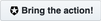

# Actions Sample Library

### 1. Send to a webhook

This action will send your entire event object to a webhook.
- Name: Forward event to a webhook
- Trigger: Post user login
- Action: [Code](https://github.com/amba-sandbox/dangerous-frog/blob/main/a0/actions/login/forward-to-a-webhook.js)

## 

### 1. 

<DESC>
- Name: <>
- Trigger: <>
- Action: [Code](<>)

## 
